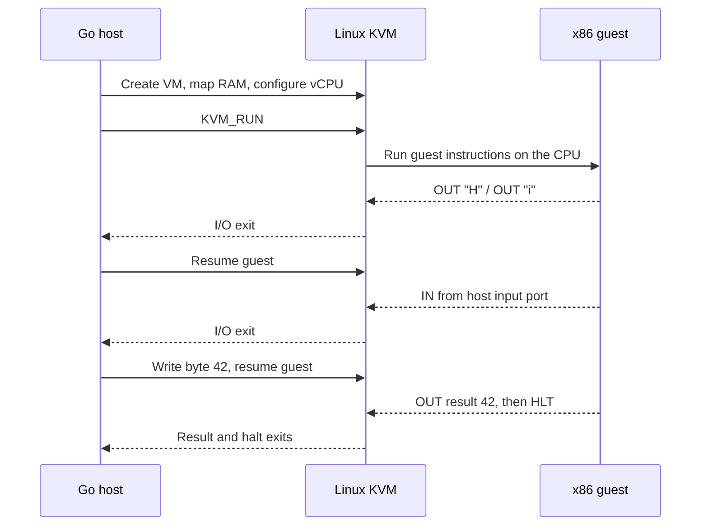

# IronVM

<div align="center">
  <p><strong>A tiny Go virtual machine monitor that makes the KVM guest/host boundary visible.</strong></p>

  <p>
    <a href="#run-ironvm">Run it</a> ·
    <a href="#the-demo">See the demo</a> ·
    <a href="#how-it-works">How it works</a> ·
    <a href="#v1-scope">V1 scope</a>
  </p>
</div>

IronVM runs a documented x86 guest program on one Linux KVM virtual CPU. The guest prints `Hi`, asks the Go host for a byte, receives `42`, sends that result back, and halts. The trace shows each time KVM hands control back to the host.

## Run IronVM

IronVM needs Linux on `amd64`, a usable `/dev/kvm`, and Go 1.27 or newer. The current demo has no software-emulation fallback: KVM must report API version 12, and your process must be allowed to open the device.

```sh
go run ./cmd/ironvm
```

## The demo

```text
KVM API: 12
guest RAM: 65536 bytes
vCPU: 0
[vm-entry]
[vm-exit] IO OUT port=0x00e9 value=0x48 ('H') exits=1
[vm-entry]
[vm-exit] IO OUT port=0x00e9 value=0x69 ('i') exits=2
[vm-entry]
[vm-exit] IO IN  port=0x5050 value=0x2a ('*') exits=3
[vm-entry]
[vm-exit] IO OUT port=0x00f4 value=0x2a ('*') exits=4
[vm-entry]
[vm-exit] HLT exits=5
guest console: Hi
host input: 42
guest result: 42
status: PASS
```

The final `PASS` means the host checked the complete I/O exchange and observed the guest halt. An unmasked host signal can interrupt `KVM_RUN`; IronVM surfaces that `EINTR` as an error rather than automatically resuming the guest.

## How it works



The guest is a short, documented sequence of x86 machine-code bytes embedded in Go. IronVM sets up guest RAM and CPU state, then directly uses Linux's KVM interface; Go handles the demo's port-I/O exits and resumes the guest.

## Project map

| Package | Responsibility |
| --- | --- |
| `cmd/ironvm` | Opens KVM and prints the run trace. |
| `internal/kvm` | Owns KVM descriptors, guest RAM, vCPU mappings, and Linux ABI calls. |
| `internal/vmm` | Loads the guest, runs it, dispatches I/O, and checks the demo result. |
| `internal/guest` | Contains the documented x86 guest program. |
| `internal/device` | Implements the small port-I/O protocol. |
| `internal/trace` | Formats the deterministic execution trace. |

## V1 scope

V1 demonstrates one VM, one vCPU, 64 KiB of guest RAM, real-mode guest execution, byte-wide port I/O, and HLT completion. It is a focused KVM learning project, not an operating-system boot path or general-purpose emulator.

Linux boot, firmware, protected or long mode, paging, multiple vCPUs, interrupts, MMIO, PCI, virtio, disks, and networking are outside V1.

## References

- [Linux KVM API documentation](https://docs.kernel.org/virt/kvm/api.html)
- [Linux KVM UAPI header](https://github.com/torvalds/linux/blob/master/include/uapi/linux/kvm.h)
- [Intel 64 and IA-32 Architectures Software Developer's Manual](https://cdrdv2-public.intel.com/782156/325383-sdm-vol-2abcd.pdf), for the guest's `MOV`, `IN`, `OUT`, and `HLT` instructions
